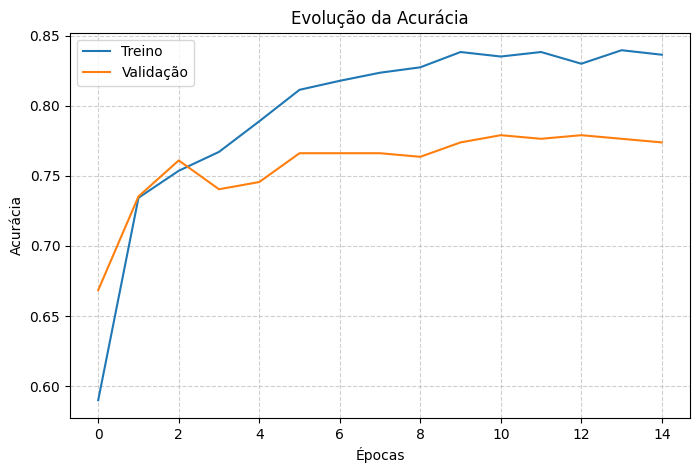
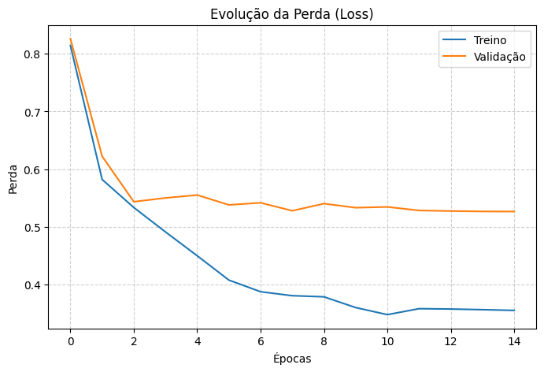

# 🦴 BoneGuard Vision API - Global Solution FIAP

Este repositório contém o microsserviço de Inteligência Artificial do projeto **BoneGuard**, desenvolvido para a Global Solution da FIAP. A API é responsável por receber imagens de radiografias (raio-x) e aplicar um modelo de Deep Learning (EfficientNetB0) para classificar a saúde óssea do paciente.

## 🎯 Objetivo
Atuar como uma ferramenta de triagem precoce para médicos e sistemas de saúde. O modelo foi otimizado (Fine-Tuning e Class Weights) para atingir **97% de sensibilidade (recall) na detecção de Osteopenia**, garantindo que pacientes em estágio inicial de perda de massa óssea sejam identificados rapidamente para intervenção clínica.

## 🏗️ Arquitetura
Este projeto atua como um **Microsserviço de IA**, encapsulado via Docker. Ele não possui interface gráfica própria (frontend), sendo desenhado para ser consumido via requisições HTTP (`POST`) pelo Backend principal (Gateway em Java).

## 🚀 Tecnologias Utilizadas
* **Python 3.12**
* **TensorFlow / Keras** (Treinamento e Inferência)
* **FastAPI** (Construção da API RESTful)
* **Uvicorn** (Servidor ASGI)
* **Docker** (Containerização)

## 📊 Desempenho do Modelo (V2)

Abaixo estão os gráficos de evolução do treinamento após a aplicação de balanceamento de peso para compensar a disparidade de imagens entre as classes.

| Acurácia | Perda (Loss) |
| :---: | :---: |
|  |  |

*Nota: O distanciamento nas épocas finais reflete a penalização forçada nas classes minoritárias para garantir a alta taxa de recall em Osteopenia, priorizando a segurança do paciente (redução de falsos negativos) sobre a acurácia global estrita.*

## ⚙️ Como Executar Localmente

### Usando Docker (Recomendado)
1. Certifique-se de ter o Docker instalado na sua máquina.
2. Na raiz do projeto, construa a imagem:
   ```bash
   docker build -t boneguard-api .