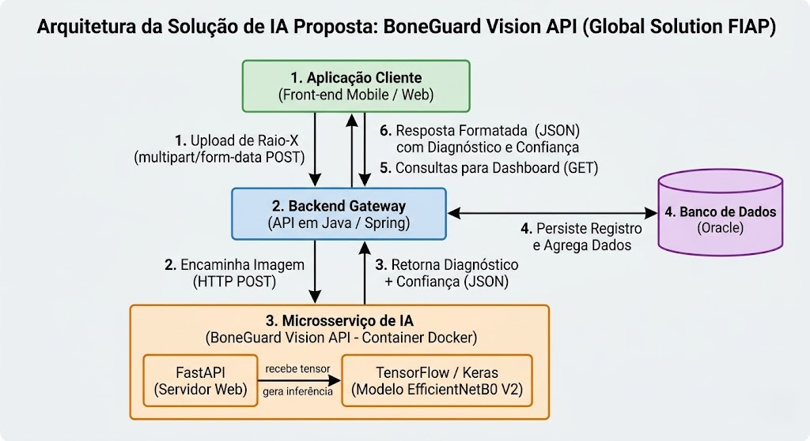
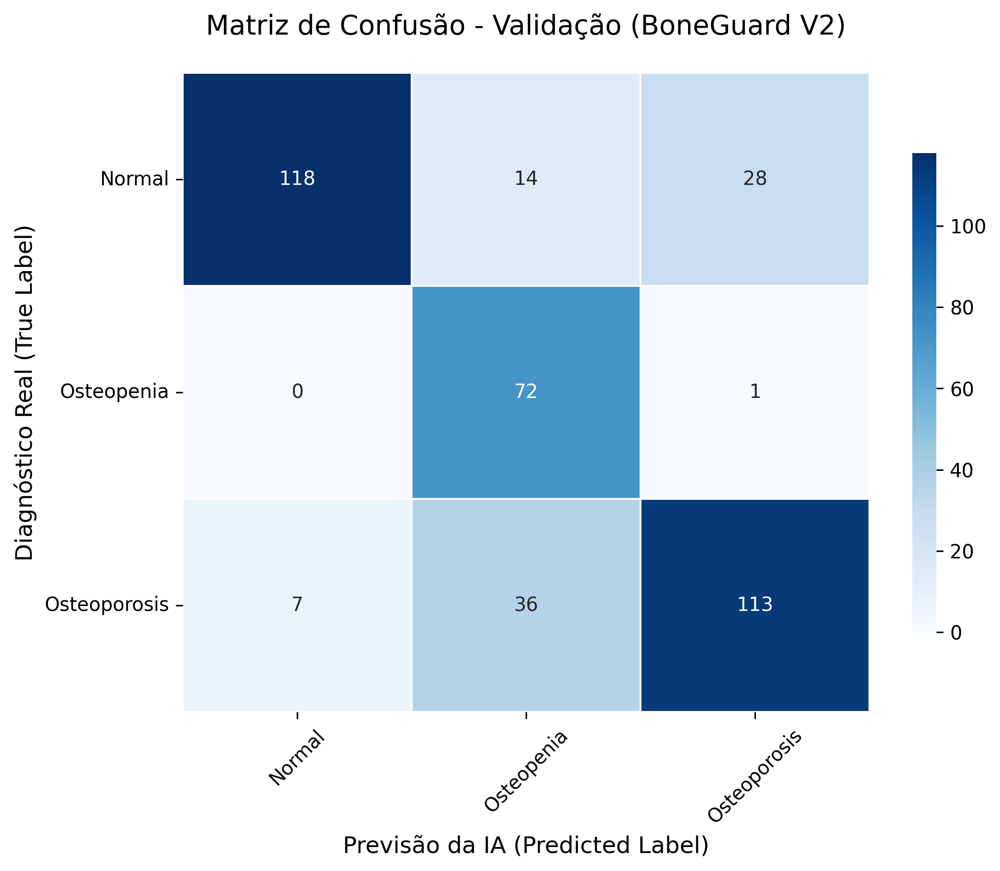

# 🦴 BoneGuard Vision API - Microsserviço de IA

Este repositório contém o microsserviço de Inteligência Artificial do projeto **BoneGuard**, desenvolvido para a Global Solution da FIAP. A API é responsável por receber imagens de radiografias (raio-x) e aplicar um modelo de Deep Learning para classificar a saúde óssea do paciente.

## 🎯 Objetivo e Contexto de Negócio
O BoneGuard atua como uma ferramenta de triagem precoce para médicos e sistemas de saúde. O modelo foi otimizado (através de *Fine-Tuning* e *Class Weights*) para priorizar a sensibilidade na classe inicial da doença. O nosso modelo atinge **97% de taxa de acerto (recall) na detecção de Osteopenia**, garantindo que pacientes em estágio inicial de perda de massa óssea sejam identificados rapidamente para intervenção clínica.

## 🏗️ Arquitetura e Fluxo de Dados
Abaixo, o diagrama da arquitetura de microsserviços do projeto, destacando a comunicação entre a interface do utilizador, o backend em Java (Gateway) e o nosso motor de IA em Python.

<div align="center">
  
</div>

### Descrição do Fluxo
1. **Aplicação Cliente:** Envia a radiografia para o Backend principal.
2. **Backend Gateway (Java):** Orquestra a requisição e encaminha a imagem para o nosso container de IA.
3. **Microsserviço de IA (Python/FastAPI/TensorFlow):** Processa a inferência e retorna o diagnóstico (classificação e confiança).
4. **Persistência:** O resultado é armazenado no banco de dados para relatórios analíticos (DataVis).

## 📊 Desempenho e Validação do Modelo (V2)

A escolha do modelo base (EfficientNetB0) foi pautada pelo equilíbrio entre performance e precisão. Para mitigar a disparidade entre as classes, aplicámos técnicas de balanceamento de pesos, resultando nos indicadores abaixo:

### Evolução do Treino e Matriz de Confusão
| Acurácia | Perda (Loss) | Matriz de Confusão |
| :---: | :---: | :---: |
|  |  |  |

*Nota: O comportamento das curvas reflete uma penalização forçada nas classes minoritárias para garantir a alta taxa de recall em Osteopenia, priorizando a segurança do paciente.*

## ⚙️ Como Executar o Projeto

### Opção 1: Usando Docker (Recomendado)
Para garantir a portabilidade, utilize a imagem conteinerizada:

1. Na raiz do projeto, construa a imagem referenciando o ficheiro dentro da pasta `docker/`:
   ```bash
   docker build -f docker/Dockerfile -t boneguard-api .
   ```

2. Corra o contentor mapeando a porta 8000:
   ```bash
   docker run -p 8000:8000 boneguard-api
   ```

### Opção 2: Usando Ambiente Virtual Python (VENV)

1. Crie e ative o ambiente virtual:
   ```bash
   python -m venv venv
   source venv/Scripts/activate  # (No Windows)
   # ou
   source venv/bin/activate      # (No Linux/Mac)
   ```

2. Instale as dependências listadas na pasta docker:
   ```bash
   pip install -r docker/requirements.txt
   ````

3. Mude para a diretoria da API e inicie o servidor:
   ```bash
   cd api
   uvicorn api:app --reload
   ```


## 📡 Documentação dos Endpoints

Quando o servidor estiver a correr, a documentação interativa (Swagger UI) pode ser acedida através de:

👉 http://localhost:8000/docs

POST /analisar-radiografia
Recebe o upload de uma imagem .jpg ou .png via multipart/form-data e retorna a predição clínica.

Exemplo de Requisição via cURL:

   ```bash
   curl -X 'POST' \
   'http://localhost:8000/analisar-radiografia' \
   -H 'accept: application/json' \
   -H 'Content-Type: multipart/form-data' \
   -F 'file=@caminho/para/o/raiox_paciente.png'
   ```

Exemplo de Resposta de Sucesso (JSON):

   ```JSON
   {
      "classificacao": "Osteopenia",
      "confianca": 0.9785,
      "probabilidades_brutas": {
         "Normal": 0.0112,
         "Osteopenia": 0.9785,
         "Osteoporosis": 0.0103
      }
   }
   ```

## 📽️Vídeo Demonstrativo

_Vídeo em prodção..._

## 👥 Integrantes

Bruno Carlos Soares - RM 559250

Lucas Borges de Souza - RM 560027

Pedro Henrique da Silva - RM 560393